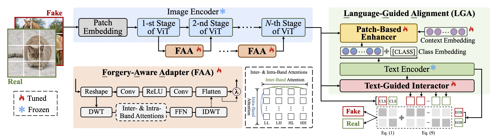

# FatFormer

This repository is an official implementation of the CVPR 2024 paper "[Forgery-aware Adaptive Transformer for Generalizable Synthetic Image Detection](https://arxiv.org/abs/2312.16649)".

☀️ If you find this work useful for your research, please kindly star our repo and cite our paper! ☀️

### TODO
We are working hard on the following items.

- [x] Release [arXiv paper](https://arxiv.org/abs/2312.16649)
- [x] Release inference scripts
- [x] Release checkpoints 
- [x] Release datasets

## Introduction

In this paper, we study the problem of generalizable synthetic image detection, e.g., GANs and diffusion models. Cutting-edge solutions start to explore the benefits of pre-trained models, and mainly follow the fixed paradigm of solely training an attached classifier. However, our analysis shows that such a fixed paradigm is prone to yield detectors with insufficient learning regarding forgery representations. We attribute the key challenge to the lack of forgery adaptation, and present a novel forgery-aware adaptive transformer approach, namely FatFormer.



Based on the pre-trained vision-language spaces of CLIP, FatFormer introduces two core designs for the adaption to build generalized forgery representations. First, motivated by the fact that both image and frequency analysis are essential for synthetic image detection, we develop a forgery-aware adapter to adapt image features to discern and integrate local forgery traces within image and frequency domains. Second, we find that considering the contrastive objectives between adapted image features and text prompt embeddings, a previously overlooked aspect, results in a nontrivial generalization improvement. Accordingly, we introduce language-guided alignment to supervise the forgery adaptation with image and text prompts in FatFormer. Experiments show that, by coupling these two designs, our approach tuned on 4-class ProGAN data attains a remarkable detection performance, achieving an average of 98% accuracy to unseen GANs, and surprisingly generalizes to unseen diffusion models with 95% accuracy.

## Model Zoo

Checkpoint can be found here([baidu](https://pan.baidu.com/s/19wijsvrX0-9Q3dzho8LjUQ?pwd=b759) & [onedrive](https://1drv.ms/u/s!Aqkrc9gPuk8jqZ5Z01EeDlzQIBGFrw?e=F6tdyX) & [Google Drive](https://drive.google.com/file/d/1Q_Kgq4ygDf8XEHgAf-SgDN6Ru_IOTLkj/view?usp=sharing)).

### Results on the GANs dataset (4-class supervision)
| Methods   | Ref        | ProGAN       | StyleGAN     | StyleGAN2     | BigGAN       | CycleGAN     | StarGAN      | GauGAN       | Deepfake     | Mean          |
|-----------|------------|--------------|--------------|---------------|--------------|--------------|--------------|--------------|--------------|--------------|
| Wang [48] | CVPR 2020  | 91.4 / 99.4  | 63.8 / 91.4  | 76.4 / 97.5   | 52.9 / 73.3  | 72.7 / 88.6  | 63.8 / 90.8  | 63.9 / 92.2  | 51.7 / 62.3  | 67.1 / 86.9  |
| Durall [11] | CVPR 2020 | 81.1 / 74.4  | 54.4 / 52.6  | 66.8 / 62.0   | 60.1 / 56.3  | 69.0 / 64.0  | 98.1 / 98.1  | 61.9 / 57.4  | 50.2 / 50.0  | 67.7 / 64.4  |
| Frank [12] | ICML 2020 | 90.3 / 85.2  | 74.5 / 72.0  | 73.1 / 71.4   | 88.7 / 86.0  | 75.5 / 71.2  | 99.5 / 99.5  | 69.2 / 77.4  | 60.7 / 49.1  | 78.9 / 76.5  |
| PatchFor [3] | ECCV 2020 | 97.8 / 100.0 | 82.6 / 93.1  | 83.6 / 98.5   | 64.7 / 69.5  | 74.5 / 87.2  | 100.0 / 100.0 | 57.2 / 55.4  | 85.0 / 93.2  | 80.7 / 87.1|
| F3Net [37] | ECCV 2020 | 99.4 / 100.0 | 92.6 / 99.7  | 88.0 / 99.8   | 65.3 / 69.9  | 76.4 / 84.3  | 100.0 / 100.0 | 58.1 / 56.7  | 63.5 / 78.8  | 80.4 / 86.2  |
| Blend† [45] | CVPR 2022 | 58.8 / 65.2  | 50.1 / 47.7  | 48.6 / 47.4   | 51.1 / 51.9  | 59.2 / 65.3  | 74.5 / 89.2  | 59.2 / 65.5  | 93.8 / 99.3  | 61.9 / 66.4  |
| BiHPF [20] | WACV 2022 | 90.7 / 86.2  | 76.9 / 75.1  | 76.2 / 74.7   | 84.9 / 81.7  | 81.9 / 78.9  | 94.4 / 94.4  | 69.5 / 78.1  | 54.4 / 54.6  | 78.6 / 77.9  |
| FrePGAN [21] | AAAI 2022 | 99.0 / 99.9 | 80.7 / 89.6  | 84.1 / 98.6   | 69.2 / 71.1  | 71.1 / 74.4  | 99.9 / 100.0 | 60.3 / 71.7  | 70.9 / 91.9  | 79.4 / 87.2  |
| LGrad [46] | CVPR 2023 | 99.9 / 100.0 | 94.8 / 99.9  | 96.0 / 99.6   | 82.9 / 90.7  | 85.3 / 94.0  | 99.6 / 100.0  | 72.4 / 79.3  | 58.0 / 67.9  | 86.1 / 91.5  |
| UniFD [35] | CVPR 2023 | 99.7 / 100.0 | 89.0 / 98.7  | 83.9 / 98.4   | 90.5 / 99.1  | 87.9 / 99.8  | 91.4 / 100.0 | 89.9 / 100.0 | 80.2 / 90.2  | 89.1 / 98.3  |
| Ours      | CVPR 2024         | 99.9 / 100.0 | 97.2 / 99.8  | 98.8 / 100.0  | 99.5 / 100.0 | 99.3 / 100.0 | 99.8 / 100.0 | 99.4 / 100.0 | 93.2 / 98.0  | 98.4 / 99.7  |

### Results on the DMs dataset (4-class supervision)
| Dataset      | Wang [48]   | Durall [11] | Frank [12] | PatchFor [3] | F3Net [37]  | Blend† [45] | LGrad [46]  | UniFD [35]  | Ours         |
|--------------|-------------|-------------|------------|--------------|-------------|-------------|-------------|-------------|--------------|
| PNDM         | 50.8 / 90.3 | 44.5 / 47.3 | 44.0 / 38.2| 50.2 / 99.9  | 72.8 / 99.5 | 48.2 / 48.1 | 69.8 / 98.5 | 75.3 / 92.5 | 99.3 / 100.0 |
| Guided       | 54.9 / 66.6 | 40.6 / 42.3 | 53.4 / 52.5| 74.2 / 81.4  | 69.2 / 70.8 | 58.3 / 63.4 | 86.6 / 100.0 | 75.7 / 85.1 | 76.1 / 92.0  |
| DALL-E       | 51.8 / 61.3 | 55.9 / 58.0 | 57.0 / 62.5| 79.8 / 99.1  | 71.6 / 79.9 | 52.4 / 51.6 | 88.5 / 97.3 | 89.5 / 96.8 | 98.8 / 99.8  |
| VQ-Diffusion | 50.0 / 71.0 | 38.6 / 38.3 | 51.7 / 66.7| 100.0 / 100.0 | 100.0 / 100.0 | 77.1 / 82.6 | 96.3 / 100.0 | 83.5 / 97.7 | 100.0 / 100.0 |
| LDM_200 steps    | 52.0 / 64.5 | 61.7 / 61.7 | 56.4 / 50.9| 95.6 / 99.9 | 73.4 / 83.3 | 52.6 / 51.9 | 94.2 / 99.1 | 90.2 / 97.1 | 98.6 / 99.8  |
| LDM_200 w/ CFG   | 51.6 / 63.1 | 58.4 / 58.5 | 56.5 / 52.1| 94.0 / 99.8 | 80.7 / 89.1 | 51.9 / 52.6 | 95.9 / 99.2 | 77.3 / 88.6 | 94.9 / 99.1  |
| LDM_100 steps    | 51.9 / 63.7 | 62.0 / 62.6 | 56.6 / 51.3| 95.8 / 99.8  | 74.1 / 84.0 | 53.0 / 54.0 | 94.8 / 99.0 | 90.5 / 97.0 | 98.7 / 99.9  |
| Glide_100-27       | 53.0 / 71.3 | 48.9 / 46.9 | 50.4 / 40.8| 82.8 / 99.1  | 87.0 / 94.5 | 59.4 / 64.1 | 87.4 / 95.2 | 90.7 / 95.8 | 94.4 / 99.1  |
| Glide_50-27        | 54.2 / 76.0 | 51.7 / 49.9 | 52.0 / 42.3| 84.9 / 98.8  | 88.5 / 95.4 | 64.2 / 68.3 | 90.7 / 97.2 | 91.1 / 97.4 | 94.7 / 99.4  |
| Glide_100-10       | 53.3 / 72.9 | 54.9 / 52.3 | 53.6 / 44.3| 87.3 / 99.7  | 88.3 / 95.4 | 58.8 / 63.2 | 89.4 / 99.0 | 90.1 / 97.4 | 94.2 / 99.2  |
| Mean         | 52.4 / 70.1 | 51.7 / 51.8 | 53.2 / 50.2| 84.5 / 97.8  | 80.6 / 89.2 | 57.6 / 60.0 | 89.4 / 97.7 | 85.4 / 94.6 | 95.0 / 98.8  |

## Datasets
### Training data
To train FatFormer, we adopt images generated by ProGAN with two training settings, consisting of 2-class (chair, horse) and 4-class (car, cat, chair, horse), following [CNNDetection](https://arxiv.org/abs/1912.11035). The original download link can be found in [here](https://github.com/peterwang512/CNNDetection#training-set). You can also download it from our [mirror site](https://pan.baidu.com/s/1obzmrCsWvGyUlmH8MkSTLA?pwd=9i5w).

### Testing data
To evaluate FatFormer, we consider the synthetic images from both GANs and diffusion models (DMs). 

* GANs dataset

  For the GANs dataset, we utilize the 8 types of GANs for testing, including ProGAN, StyleGAN, StyleGAN2, BigGAN, CycleGAN, StarGAN, GauGAN and DeepFake, following [LGrad](https://openaccess.thecvf.com/content/CVPR2023/papers/Tan_Learning_on_Gradients_Generalized_Artifacts_Representation_for_GAN-Generated_Images_Detection_CVPR_2023_paper.pdf). The original download link can be found [here](https://github.com/peterwang512/CNNDetection#testset). You can also download from our [baidu mirror site](https://pan.baidu.com/s/1aAiW8oMQcIZIaLYuQIOAjg?pwd=75cz) and [onedrive mirror site](https://1drv.ms/u/s!Aqkrc9gPuk8jqaM2khCvAejz_K4Jow?e=e0yeDQ).

* DMs dataset

  For the DMs dataset, we collect 6 types of SOTA DMs, including PNDM, Guided, DALL-E, VQ-Diffusion, LDM, and Glide, from [DIRE](https://arxiv.org/abs/2303.09295) and [UniversalFakeDetect](https://arxiv.org/abs/2302.10174). The original download link can be found [here](https://github.com/ZhendongWang6/DIRE#diffusionforensics-dataset) and [here](https://github.com/Yuheng-Li/UniversalFakeDetect#data). You can also download from our [baidu mirror site](https://pan.baidu.com/s/1zoubPr5n_mGI27En9uyL8Q?pwd=a6sw) and [onedrive mirror site](https://1drv.ms/u/s!Aqkrc9gPuk8jqaM1LAthli7KdRhr2A?e=ebbG9r).

### Data Folder Formulation
We expect the directory structure to be the following:
```
path/to/dataset/
├── train/
|   ├── car/ # sub-category of ProGAN
|   |   ├── 0_real # real images
|   |   └── 1_fake # fake images
|   └── ...
└── test/
    ├── AttGAN/ # testing generators
    |   ├── 0_real # real images
    |   └── 1_fake # fake images
    └── ...   
```

## Installation
### Requirements
The code is developed and validated with ```python=3.7.10,pytorch=1.7.1,cuda=11.0```. Higher versions might be as well.

1. Create your own Python environment with [Anaconda](https://www.anaconda.com/download).
```shell
conda create -n fatformer python=3.7.10
```

2. Activate `fatformer` environment and install PyTorch, torchvision, and other Python packages.
```shell
conda activate fatformer
# pytorch, torchvision
conda install pytorch==1.7.1 torchvision==0.8.2 cudatoolkit=11.0 -c pytorch
# others
pip install hashlib pkg_resources tqdm gzip
```

3. To support frequency analysis, you also need to install the `pytorch_wavelets` package following the [pytorch wavelets](https://github.com/fbcotter/pytorch_wavelets) instruction.

4. Clone this repo.
```shell
git clone https://github.com/Michel-liu/FatFormer.git
cd FatFormer
```

## Inference Guidance

We provide the command to evaluate FatFormer on a single node with 4 gpus.

### Evaluating on the GANs dataset

- `CLIP:ViT-L/14` as backbone, you need first to download the [checkpoint](https://openaipublic.azureedge.net/clip/models/b8cca3fd41ae0c99ba7e8951adf17d267cdb84cd88be6f7c2e0eca1737a03836/ViT-L-14.pt) and save it into `pretrained` folder under the FatFormer code base.

```bash
export CUDA_VISIBLE_DEVICES=0,1,2,3
python -m torch.distributed.launch \
    --nproc_per_node=4 \
    --master_port 29579 \
    main.py \
    --dataset_path <path/to/dataset/> \
    --test_selected_subsets 'progan' 'stylegan' 'stylegan2' 'biggan' 'cyclegan' 'stargan' 'gaugan' 'deepfake' \
    --eval \
    --pretrained_model <path/to/ckpt/> \
    --num_vit_adapter 3 \
    --num_context_embedding 8
```

### Evaluating on the DMs dataset
You only need to change the `--test_selected_subsets` flag with DMs that you want to evaluate.

## License
FatFormer is released under the Apache 2.0 license. Please see the [LICENSE](LICENSE) file for more information.

## Acknowledgement
This project is built on the open-source repositories [CNNDetection](https://github.com/peterwang512/CNNDetection), [LGrad](https://github.com/chuangchuangtan/LGrad), [DIRE](https://github.com/ZhendongWang6/DIRE) and [UniversalFakeDetect](https://github.com/Yuheng-Li/UniversalFakeDetect).
Thank them for their well-organized codes and datasets!

## Citation
```bibtex
@inproceedings{liu2024forgeryaware,
  title       = {Forgery-aware Adaptive Transformer for Generalizable Synthetic Image Detection},
  author      = {Liu, Huan and Tan, Zichang and Tan, Chuangchuang and Wei, Yunchao and Wang, Jingdong and Zhao, Yao},
  booktitle   = {Proceedings of the IEEE/CVF Conference on Computer Vision and Pattern Recognition (CVPR)},
  year        = {2024},
}
```
